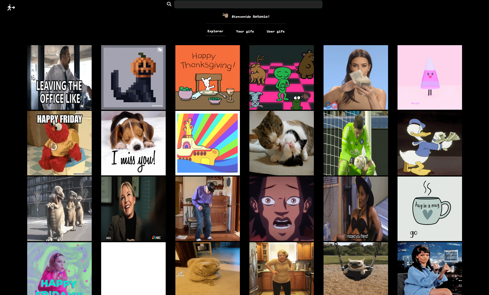

# Smoothsick

This project is based on the page Giphy and mocks the gif platform, trying with this to improve my knowledge of react and another related libraries.\
 

 

This web application uses on <u><i>frontend</i></u>:

<b><ul>

  <li>React v18.2</li>
  <li>React router v6.9 for the route management</li>
  <li>Tailwind v3.2.7</li>
  <li>React-oauth/google for google authentication</li>
  <li>Sweetalert2 for toasts</li>
  
</ul></b>

On the <u><i>backend:</i></u>

<b><ul>
  <li>Node.js</li>
  <li>Express.js</li>
  <li>Mongoose</li>
  <li>MongoDB</li>
  <li>Swagger</li>
  <li>Postman</li>
</ul></b>
 

You can visit this page through this link ✈️ <a>https://giphi.arcprojects.es</a>\
 

👩‍🚀 I hope you enjoy it! 🚀

 
(●'◡'●) (●'◡'●) (●'◡'●)